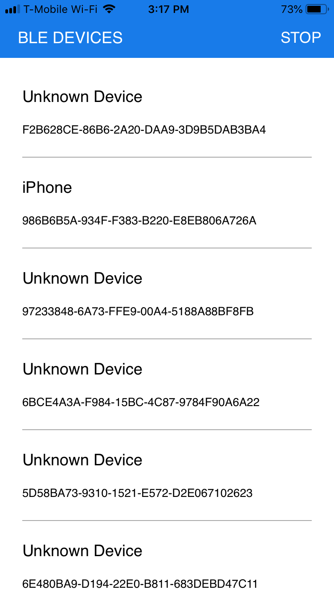
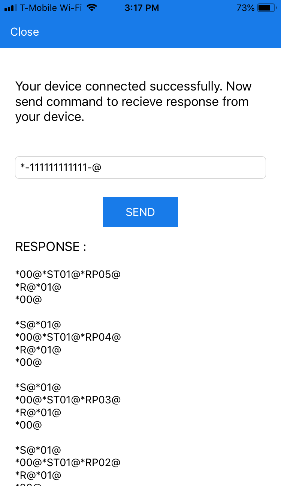
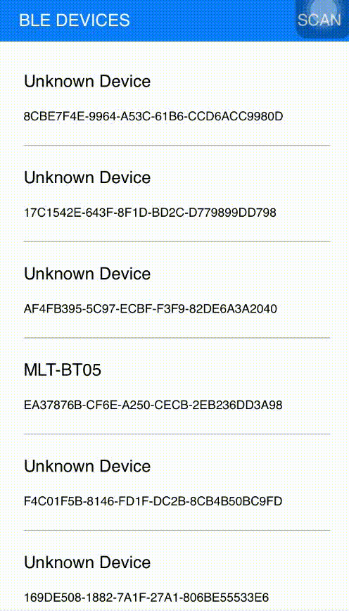

# BLE-Embedded-iOS-Sample

# Summary 

This sample code is used to scan all near by BLE Embedded hardware device and connect specific device. In sample we have connected HM10 Bluetooth Serial with iOS app. The helper class BLEManager.swift is used for the bluetooth communication. We have used CoreBluetooth framework to scan and connect BLE device.

# Screenshots

  

